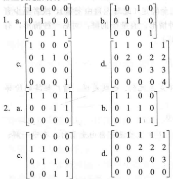

非零行的最左边元素为该行先导元素。

阶梯型矩阵满足：
1. 每一个非零行都在每一个零行之上。
2. 某一行的先导元素所在列位于前一行先导元素右边。
3. 某一行先导元素所在列下方元素都是零。
$$\begin{bmatrix} 2 & -3 & 2 & 1 \\ 0 & 1 & -4 & 8 \\ 0 & 0 & 0 &4 \end{bmatrix}$$

简化阶梯型
1. 阶梯型矩阵。
2. 每一非零行的先导元素是1。
3. 每一先导元素1是该元素所在列的唯一非零元素。
$$\begin{bmatrix} 1 & 0 & 0 & 29 \\ 0 & 1 & 0 & 8 \\ 0 & 0 & 1 &4 \end{bmatrix}$$

每个矩阵行等价于唯一的简化阶梯型矩阵。若A行等价与阶梯型矩阵U，则称U为A的阶梯型。若U是简化阶梯型，则U是A的简化阶梯型。

#### 主元位置

主元位置是A对于与它的简化阶梯型中先导元素1的位置。主元列是A的含有主元位置的列。

#### 行化简算法

利用初等行变换先变为阶梯型再变为简化阶梯型。

#### 线性方程组的解

可以将行化简算法应用于线性方程组的增广矩阵：
$$\begin{bmatrix} 1 & 0 & -5  & 1 \\ 0 & 1 & 1 & 4 \\ 0 & 0 & 0 & 0 \end{bmatrix}$$
$$
\begin{aligned} x_1 \quad - 5x_3 &= 1 \\  x_2 + x_3 &= 4 \\  0 &= 0 \end{aligned}
$$
对应于主元列的$x_1$和$x_2$称为基本变量，其余的$x_3$称为自由变量。

#### 存在性和唯一性的问题

线性方程组相容的充要条件是增广矩阵的最右列不是主元列，也就是说，增广矩阵的阶梯型没有形如
$$\begin{bmatrix} 0 & ... & 0 & b \end{bmatrix},b \neq0$$
的行（无解）。

当线性方程组相容时，解集可能
- 当没有自由变量时，有唯一解。
- 若至少有一个自由变量，有无穷多解。

### 习题

1. 确定哪些是简化阶梯型，哪些是阶梯型。

1.a是简化阶梯型。
1.b是简化阶梯型。
1.c不是阶梯型矩阵，因为非零行在零行之上。
1.d是阶梯型矩阵，因为先导元素不是1。
2.a是简化阶梯型矩阵。
2.b是阶梯型矩阵，因为第三行先导元素上一行不是0。
2.c不是阶梯型矩阵，不满足先导元素下方都是0。
2.d是阶梯型矩阵，因为先导元素不是1。

3. 化简为简化阶梯型并标注主元位置和主元列。

5. 给出一个非零$2 \times 2$矩阵可能的阶梯型。
$$\begin{bmatrix} \$ & \star \\ 0 & $ \end{bmatrix}$$
6. 给出一个非零$3 \times 3$矩阵可能的阶梯型。
$$\begin{bmatrix} \$ & \star \\ 0 & $ \\ 0 & 0\end{bmatrix}$$
